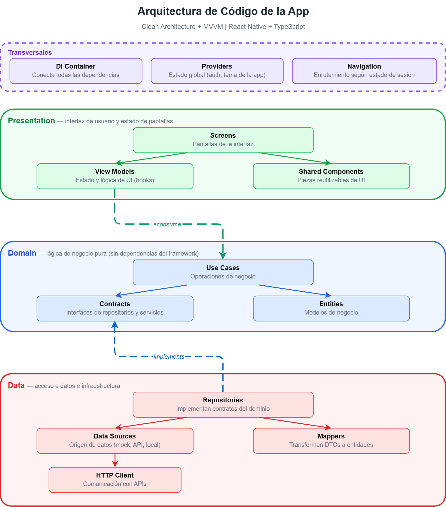
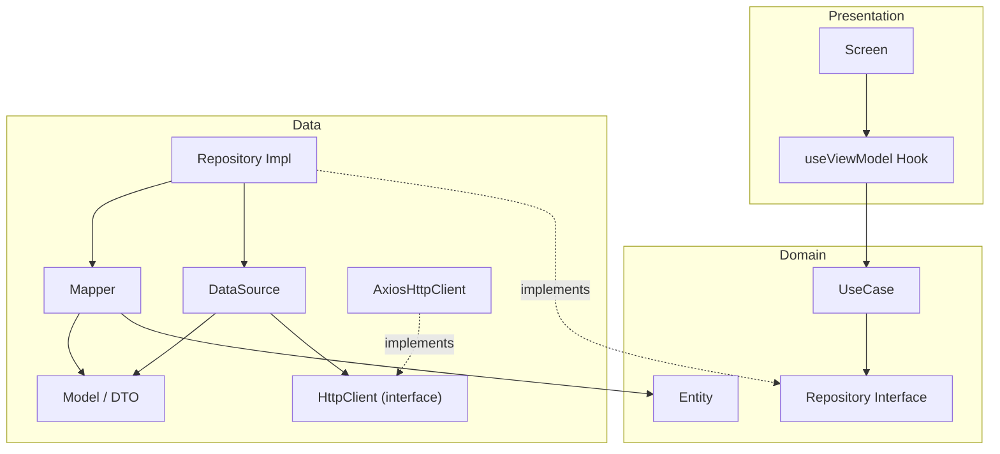
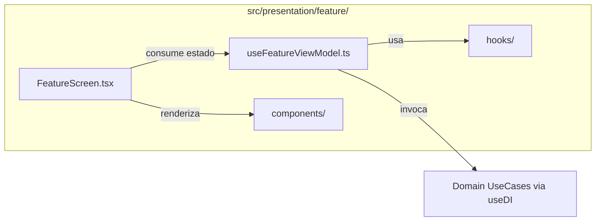
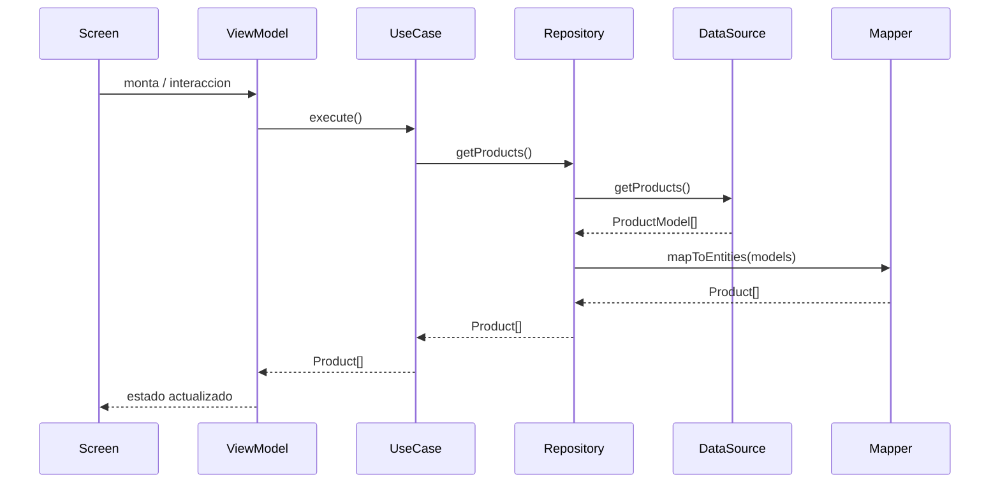

# Guia de Arquitectura - BBApp

## Vista general

BBApp sigue una arquitectura **Clean Architecture** con el patrón **MVVM** y organización **Feature-First** en la capa de presentación. La inyección de dependencias se realiza de forma manual mediante React Context.

Vista general de la arquitectura por capas (transversales, presentación, dominio y datos):



### Por qué Clean Architecture

Separa la lógica de negocio (Domain) de la infraestructura (Data) y la UI (Presentation). Esto permite cambiar frameworks, fuentes de datos o librerías HTTP sin modificar las reglas de negocio. Para una app bancaria donde la confiabilidad es crítica, esta separación reduce el riesgo de que un cambio técnico introduzca errores en lógica financiera.

### Por qué MVVM

Los View Models (hooks personalizados) encapsulan el estado y la lógica de cada pantalla, manteniendo los Screens como componentes de renderizado puro. Este patrón se alinea naturalmente con React Hooks y facilita testear la lógica de UI sin montar componentes.

### Por qué Feature-First

Cada feature agrupa su Screen, View Model y componentes locales en una sola carpeta. Esto hace que agregar, modificar o eliminar un feature sea una operación aislada, sin tocar carpetas de otros features. Aplica exclusivamente a `src/presentation/`; las capas Domain y Data se organizan por tipo técnico porque sus artefactos son compartidos entre features.

## Estado actual del repositorio

Actualmente el proyecto es una unica aplicacion **React Native** con estas decisiones activas:

- `App.tsx` compone la jerarquia `DIProvider -> AuthProvider -> ThemeProvider -> SafeAreaProvider -> NavigationContainer -> AppNavigator`.
- `src/di/container.ts` funciona como composition root y registra los casos de uso principales.
- La autenticacion combina un datasource remoto disponible (`AuthRemoteDataSource`) con un repositorio conectado hoy a un datasource mock para el flujo principal.
- Las transacciones se sirven actualmente desde `MockTransactionDataSource`.
- La navegacion depende del estado de sesion expuesto por `AuthProvider`.
- El estado visual transversal se resuelve con `ThemeProvider` y Zustand.

## Documentos relacionados

- `docs/STANDARDS.md`: estandares de arquitectura, codigo, naming y Definition of Done.
- `docs/TESTING.md`: estrategia de testing con Jest y Maestro.

```
src/
├── di/                  # Inyeccion de dependencias (composition root)
├── domain/              # Logica de negocio pura (sin dependencias de framework)
│   ├── entities/        # Modelos de dominio
│   ├── repositories/    # Interfaces (contratos) de repositorios
│   ├── services/        # Interfaces de servicios de dominio
│   └── usecases/        # Casos de uso
├── data/                # Implementaciones y acceso a datos
│   ├── api/             # HttpClient (interfaz) + AxiosHttpClient (impl)
│   ├── datasources/     # Fuentes de datos (mock, API, local)
│   ├── models/          # DTOs (modelos de transferencia de datos)
│   ├── mappers/         # Transformadores DTO <-> Entidad
│   ├── repositories/    # Implementaciones de repositorios
│   └── services/        # Implementaciones de servicios
├── presentation/        # UI (pantallas + View Models)
│   ├── auth/            # Feature de autenticacion
│   ├── transactions/    # Feature de transacciones
│   └── components/      # Componentes compartidos entre features
├── navigation/          # Configuracion de navegacion
└── providers/           # Proveedores transversales (auth, tema)
    └── theme/           # Sistema de temas
```

## Diagrama de capas



**Regla de dependencia:** las capas internas nunca conocen a las externas. `domain` no importa nada de `data` ni de `presentation`. La capa `data` implementa las interfaces definidas en `domain`. La capa `presentation` consume casos de uso a traves de la inyeccion de dependencias.

## Descripcion de capas

### Domain (`src/domain/`)

Capa central sin dependencias de React ni de librerias externas. Contiene la logica de negocio pura.

**Entities** - Modelos de dominio que representan los conceptos de la aplicacion:

```typescript
// src/domain/entities/Transaction.ts
export interface Transaction {
  id: string;
  description: string;
  amount: number;
  date: string;
  type: TransactionType;
  category: TransactionCategory;
  status: TransactionStatus;
}
```

**Repository interfaces** - Contratos que definen como se accede a los datos, sin especificar la implementacion:

```typescript
// src/domain/repositories/TransactionRepository.ts
export interface TransactionRepository {
  getTransactions(): Promise<Transaction[]>;
}
```

**Use Cases** - Encapsulan una operacion de negocio. Reciben un repositorio por constructor y exponen un metodo `execute()`:

```typescript
// src/domain/usecases/LoginUseCase.ts
export class LoginUseCase {
  constructor(private readonly authRepository: AuthRepository) {}

  async execute(email: string, password: string): Promise<User> {
    // validaciones de negocio...
    return this.authRepository.login(trimmedEmail, trimmedPassword);
  }
}
```

**Services** - Interfaces para capacidades de infraestructura (ej. almacenamiento seguro):

```typescript
// src/domain/services/SecureStorageService.ts
export interface SecureStorageService {
  save(key: string, value: string): Promise<void>;
  get(key: string): Promise<string | null>;
  remove(key: string): Promise<void>;
  clear(): Promise<void>;
}
```

### Data (`src/data/`)

Implementa los contratos de `domain` y gestiona el acceso a datos.

- **API (`api/`)**: infraestructura HTTP. Define la interfaz `HttpClient` y su implementacion `AxiosHttpClient`. Los datasources remotos reciben un `HttpClient` por constructor en lugar de importar un singleton, lo que permite inyectar fakes en tests.
- **DataSources**: fuentes de datos concretas (actualmente mocks, en el futuro APIs REST, GraphQL, bases de datos locales).
- **Models (DTOs)**: representan la forma de los datos tal como vienen de la fuente (API response, DB row). Pueden tener mas campos que la entidad de dominio.
- **Mappers**: funciones puras que transforman DTOs a entidades de dominio y viceversa.
- **Repository Implementations**: implementan la interfaz del dominio, orquestan datasource + mapper.

```typescript
// src/data/repositories/TransactionRepositoryImpl.ts
export class TransactionRepositoryImpl implements TransactionRepository {
  constructor(private readonly dataSource: TransactionDataSource) {}

  async getTransactions(): Promise<Transaction[]> {
    const models = await this.dataSource.getTransactions();
    return mapTransactionModelsToEntities(models);
  }
}
```

### Presentation (`src/presentation/`)

Cada feature tiene su propia carpeta con dos archivos:

- **Screen** (`LoginScreen.tsx`): componente React con la UI. Solo renderiza y delega logica al ViewModel.
- **ViewModel** (`useLoginViewModel.ts`): hook personalizado que gestiona el estado local, llama a los casos de uso via `useDI()`, y expone datos listos para la UI.

```typescript
// src/presentation/transactions/useTransactionsViewModel.ts
export function useTransactionsViewModel() {
  const {getTransactionsUseCase} = useDI();

  // estado, carga de datos, calculos derivados (balance, ingresos, gastos)

  return { transactions, isLoading, error, balance, income, expenses, retry };
}
```

### DI - Inyeccion de dependencias (`src/di/`)

El **composition root** esta en `container.ts`. Aqui se instancian todas las dependencias y se conectan entre si:

```typescript
// src/di/container.ts
export interface AppContainer {
  loginUseCase: LoginUseCase;
  getTransactionsUseCase: GetTransactionsUseCase;
  secureStorageService: SecureStorageService;
  authRemoteDataSource: AuthRemoteDataSource;
}

export function createContainer(): AppContainer {
  const httpClient = new AxiosHttpClient(baseUrl, headers);
  const secureStorageService = new SecureStorageServiceImpl();
  const authDataSource = new MockAuthDataSource();
  const authRemoteDataSource = new AuthRemoteDataSource(httpClient);
  const authRepository = new AuthRepositoryImpl(authDataSource);
  const loginUseCase = new LoginUseCase(authRepository);
  // ...
  return { loginUseCase, getTransactionsUseCase, secureStorageService, authRemoteDataSource };
}
```

`DIProvider` expone el contenedor via React Context. Los ViewModels acceden a los casos de uso con el hook `useDI()`.

### Providers (`src/providers/`)

Concerns transversales que envuelven toda la app:

- **AuthProvider**: gestiona la sesion del usuario (persistencia con EncryptedStorage, estado de autenticacion).
- **ThemeProvider**: sincroniza el modo del sistema (light/dark) con el store de Zustand.

### Navigation (`src/navigation/`)

`AppNavigator` define un Native Stack con routing basado en autenticacion:

- Si `isAuthenticated === true` → muestra `TransactionsScreen`
- Si `isAuthenticated === false` → muestra `LoginScreen`

### Jerarquia de providers (App.tsx raiz)

```
DIProvider
  └── AuthProvider
      └── ThemeProvider
          └── SafeAreaProvider
              └── NavigationContainer
                  └── AppNavigator
```

El orden importa: `AuthProvider` necesita `useDI()`, por lo tanto `DIProvider` debe estar arriba.

---

## Organizacion Feature-First (Presentation)

Dentro de la capa de presentacion, el proyecto adopta una estrategia **Feature-First**: cada funcionalidad de la aplicacion se agrupa en su propia carpeta bajo `src/presentation/`. Esto significa que todos los archivos relacionados con un feature (pantalla, ViewModel y, en el futuro, componentes auxiliares, hooks o estilos propios) viven juntos en un mismo directorio.

### Estructura actual

```
src/presentation/
├── auth/                        # Feature de autenticacion
│   ├── LoginScreen.tsx          # Pantalla (UI)
│   └── useLoginViewModel.ts     # ViewModel (logica de estado)
└── transactions/                # Feature de transacciones
    ├── TransactionsScreen.tsx
    └── useTransactionsViewModel.ts
```

### Estructura esperada conforme crece un feature

Cuando un feature crece en complejidad, su carpeta puede expandirse manteniendo la cohesion:

```
src/presentation/<feature>/
├── <Feature>Screen.tsx            # Pantalla principal
├── use<Feature>ViewModel.ts       # ViewModel principal
├── components/                    # Componentes exclusivos del feature
│   ├── <Feature>Card.tsx
│   └── <Feature>Filter.tsx
├── hooks/                         # Hooks auxiliares del feature
│   └── use<Feature>Filter.ts
└── styles/                        # Estilos compartidos dentro del feature
    └── <feature>.styles.ts
```

### Diagrama de relacion interna



### Por que Feature-First

| Beneficio | Descripcion |
|---|---|
| **Cohesion** | Todo lo relacionado a un feature esta en un solo lugar; no hay que buscar en multiples carpetas por tipo de archivo. |
| **Escalabilidad** | Agregar un nuevo feature es crear una nueva carpeta sin tocar las existentes. |
| **Aislamiento de cambios** | Modificar un feature impacta solo su carpeta, reduciendo conflictos en equipo. |
| **Navegacion rapida** | El arbol de archivos refleja las funcionalidades de la app, no categorias tecnicas genericas. |
| **Eliminacion limpia** | Remover un feature completo es eliminar una sola carpeta (mas su registro en DI y navegacion). |

> **Nota:** la estrategia Feature-First aplica exclusivamente a `src/presentation/`. Las capas `domain` y `data` mantienen una organizacion por tipo tecnico (`entities/`, `repositories/`, `usecases/`, etc.) ya que sus artefactos son compartidos entre multiples features.

---

## Guia paso a paso: implementar un nuevo feature

A continuacion se detalla como agregar un feature nuevo siguiendo la arquitectura existente. Se usa **"Productos"** como ejemplo.

### Paso 1: Crear la entidad de dominio

Crear `src/domain/entities/Product.ts`:

```typescript
export interface Product {
  id: string;
  name: string;
  price: number;
  description: string;
  category: string;
}
```

### Paso 2: Crear la interfaz del repositorio

Crear `src/domain/repositories/ProductRepository.ts`:

```typescript
import {Product} from '../entities/Product';

export interface ProductRepository {
  getProducts(): Promise<Product[]>;
  getProductById(id: string): Promise<Product>;
}
```

### Paso 3: Crear el caso de uso

Crear `src/domain/usecases/GetProductsUseCase.ts`:

```typescript
import {Product} from '../entities/Product';
import {ProductRepository} from '../repositories/ProductRepository';

export class GetProductsUseCase {
  constructor(private readonly productRepository: ProductRepository) {}

  async execute(): Promise<Product[]> {
    return this.productRepository.getProducts();
  }
}
```

### Paso 4: Crear el modelo de datos (DTO)

Crear `src/data/models/ProductModel.ts`:

```typescript
export interface ProductModel {
  id: string;
  product_name: string;
  unit_price: number;
  description: string;
  category_id: string;
  category_name: string;
  created_at: string;
}
```

### Paso 5: Crear el mapper

Crear `src/data/mappers/ProductMapper.ts`:

```typescript
import {Product} from '../../domain/entities/Product';
import {ProductModel} from '../models/ProductModel';

export function mapProductModelToEntity(model: ProductModel): Product {
  return {
    id: model.id,
    name: model.product_name,
    price: model.unit_price,
    description: model.description,
    category: model.category_name,
  };
}

export function mapProductModelsToEntities(models: ProductModel[]): Product[] {
  return models.map(mapProductModelToEntity);
}
```

### Paso 6: Crear el datasource

Crear `src/data/datasources/MockProductDataSource.ts`:

```typescript
import {ProductModel} from '../models/ProductModel';

export class MockProductDataSource {
  async getProducts(): Promise<ProductModel[]> {
    // Simular delay de red
    await new Promise(resolve => setTimeout(resolve, 800));
    return [
      // datos mock...
    ];
  }
}
```

### Paso 7: Implementar el repositorio

Crear `src/data/repositories/ProductRepositoryImpl.ts`:

```typescript
import {Product} from '../../domain/entities/Product';
import {ProductRepository} from '../../domain/repositories/ProductRepository';
import {MockProductDataSource} from '../datasources/MockProductDataSource';
import {mapProductModelsToEntities} from '../mappers/ProductMapper';

export class ProductRepositoryImpl implements ProductRepository {
  constructor(private readonly dataSource: MockProductDataSource) {}

  async getProducts(): Promise<Product[]> {
    const models = await this.dataSource.getProducts();
    return mapProductModelsToEntities(models);
  }

  async getProductById(id: string): Promise<Product> {
    // implementacion...
  }
}
```

### Paso 8: Registrar en el contenedor DI

Editar `src/di/container.ts`:

```typescript
// Agregar import
import {GetProductsUseCase} from '../domain/usecases/GetProductsUseCase';
import {ProductRepositoryImpl} from '../data/repositories/ProductRepositoryImpl';
import {MockProductDataSource} from '../data/datasources/MockProductDataSource';

// Agregar al interface
export interface AppContainer {
  loginUseCase: LoginUseCase;
  getTransactionsUseCase: GetTransactionsUseCase;
  getProductsUseCase: GetProductsUseCase;  // <-- nuevo
  secureStorageService: SecureStorageService;
}

// Agregar en createContainer()
export function createContainer(): AppContainer {
  // ... existentes ...
  const productDataSource = new MockProductDataSource();
  const productRepository = new ProductRepositoryImpl(productDataSource);
  const getProductsUseCase = new GetProductsUseCase(productRepository);

  return {
    // ... existentes ...
    getProductsUseCase,
  };
}
```

### Paso 9: Crear el ViewModel

Crear `src/presentation/products/useProductsViewModel.ts`:

```typescript
import {useState, useCallback, useEffect} from 'react';
import {Product} from '../../domain/entities/Product';
import {useDI} from '../../di';

export function useProductsViewModel() {
  const [products, setProducts] = useState<Product[]>([]);
  const [isLoading, setIsLoading] = useState(true);
  const [error, setError] = useState<string | null>(null);

  const {getProductsUseCase} = useDI();

  const loadProducts = useCallback(async () => {
    setIsLoading(true);
    setError(null);
    try {
      const result = await getProductsUseCase.execute();
      setProducts(result);
    } catch (err) {
      setError(err instanceof Error ? err.message : 'Error al cargar productos');
    } finally {
      setIsLoading(false);
    }
  }, [getProductsUseCase]);

  useEffect(() => {
    loadProducts();
  }, [loadProducts]);

  return {products, isLoading, error, retry: loadProducts};
}
```

### Paso 10: Crear la pantalla

Crear `src/presentation/products/ProductsScreen.tsx`:

```typescript
import React from 'react';
import {View, Text, FlatList} from 'react-native';
import {useProductsViewModel} from './useProductsViewModel';
import {useTheme} from '../../providers/theme';

export function ProductsScreen() {
  const {products, isLoading, error, retry} = useProductsViewModel();
  const {colors} = useTheme();

  // renderizar UI usando products, colors, etc.
}
```

### Paso 11: Agregar la ruta en el navegador

Editar `src/navigation/AppNavigator.tsx`:

```typescript
// Agregar import
import {ProductsScreen} from '../presentation/products/ProductsScreen';

// Agregar al type de rutas
export type RootStackParamList = {
  Login: undefined;
  Transactions: undefined;
  Products: undefined;  // <-- nuevo
};

// Agregar el Screen dentro del Navigator
<Stack.Screen name="Products" component={ProductsScreen} />
```

---

## Flujo de datos completo



---

## Convenciones de nombres

| Tipo | Patron | Ejemplo | Ubicacion |
|---|---|---|---|
| Entidad | `PascalCase` | `Product.ts` | `src/domain/entities/` |
| Interfaz de repositorio | `PascalCase` + sufijo `Repository` | `ProductRepository.ts` | `src/domain/repositories/` |
| Caso de uso | `Verbo` + `Sustantivo` + `UseCase` | `GetProductsUseCase.ts` | `src/domain/usecases/` |
| Modelo/DTO | `PascalCase` + sufijo `Model` | `ProductModel.ts` | `src/data/models/` |
| Mapper | `PascalCase` + sufijo `Mapper` | `ProductMapper.ts` | `src/data/mappers/` |
| DataSource | Prefijo `Mock`/`Remote`/`Local` + `DataSource` | `MockProductDataSource.ts` | `src/data/datasources/` |
| Impl repositorio | Nombre interfaz + `Impl` | `ProductRepositoryImpl.ts` | `src/data/repositories/` |
| ViewModel | `use` + `Feature` + `ViewModel` | `useProductsViewModel.ts` | `src/presentation/<feature>/` |
| Screen | `Feature` + `Screen` | `ProductsScreen.tsx` | `src/presentation/<feature>/` |

---

## Sistema de temas

El tema se gestiona con **Zustand** y soporta tres modos: `light`, `dark` y `system`.

### Usar colores en un componente

```typescript
import {useTheme} from '../providers/theme';

function MyComponent() {
  const {colors, isDark, toggleTheme} = useTheme();

  return (
    <View style={{backgroundColor: colors.background}}>
      <Text style={{color: colors.textPrimary}}>Hola</Text>
    </View>
  );
}
```

### Agregar un nuevo token de color

Editar `src/providers/theme/colors.ts`:

1. Agregar la propiedad a la interfaz `ThemeColors`.
2. Agregar el valor correspondiente en `LightColors` y en `DarkColors`.

```typescript
export interface ThemeColors {
  // ... existentes ...
  accent: string;  // <-- nuevo
}

export const LightColors: ThemeColors = {
  // ... existentes ...
  accent: '#F59E0B',
};

export const DarkColors: ThemeColors = {
  // ... existentes ...
  accent: '#FBBF24',
};
```

El nuevo color estara disponible automaticamente via `useTheme().colors.accent`.
