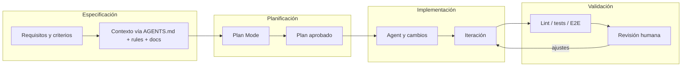
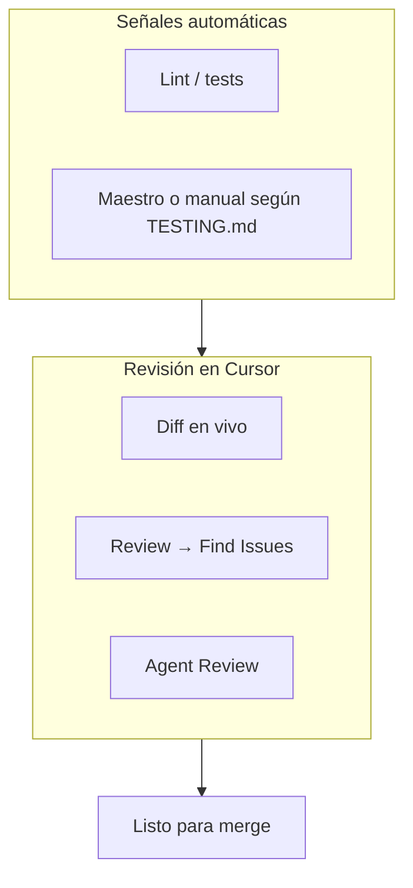

# Flujo de trabajo con Cursor

Este documento describe cómo usar Cursor en el proyecto, desde la definición del trabajo hasta la validación.

## Vista general del ciclo

## 1. Especificación

Definir el objetivo de forma observable: qué pantalla, caso de uso, contrato de datos o recorrido de usuario se está trabajando.

El agente ya recibe la arquitectura y las convenciones a través de `AGENTS.md` y las reglas de proyecto. Solo hace falta mencionar archivos con `@` cuando se conoce el punto exacto del cambio. Lo que sí conviene dejar explícito en el mensaje son los criterios de aceptación particulares, los endpoints reales y cualquier impacto en flujos Maestro.

Si la tarea tiene insumos visuales o contractuales (mockups, specs de API, diagramas de flujo), colocarlos en `docs/ref/` y referenciarlos con `@` en el mensaje. Eso le da al agente contexto concreto sin pegar contenido en el chat. Ver `docs/ref/README.md` para la estructura y las convenciones de esa carpeta.

## 2. Planificación (Plan Mode)

Activar Plan Mode con Shift+Tab antes de generar código. El agente investiga el código, puede hacer preguntas de aclaración, arma un plan con rutas de archivo y espera confirmación antes de implementar.

El plan se puede ajustar directamente en el Markdown que abre Cursor. Si el equipo quiere conservar historial, guardarlo en `.cursor/plans/`.

Si el resultado no coincide con lo pedido, volver al plan, ajustarlo y re-ejecutar suele ser más rápido que encadenar muchos mensajes correctivos.

## 3. Implementación

Usar Agent cuando se necesite editar archivos, correr comandos y cerrar el ciclo con verificaciones.

Las reglas de proyecto (`.cursor/rules/`) guían al agente automáticamente. Para cambiar el comportamiento, editar las reglas y versionarlas en git.

Conviene abrir una conversación nueva al cambiar de feature o cuando el agente repita el mismo error. Para retomar trabajo previo sin pegar chats enteros, se puede usar `@Past Chats`.

Los flujos que se repiten se pueden definir en `.cursor/commands/` y ejecutarlos con `/` (por ejemplo `feature`, `review`, `pr`; ver `.cursor/README.md`).

## 4. Validación

Después de cambios grandes, pedir explícitamente lint y tests. Durante la generación, revisar el diff y detener si la dirección no es correcta.

Al terminar, usar las herramientas de revisión del agente. En PRs, Bugbot ayuda a detectar problemas temprano.

El Definition of Done del equipo (`docs/STANDARDS.md`) sigue siendo obligatorio: la IA acelera, no reemplaza el criterio humano.

## 5. Patrones útiles

- TDD con agente: escribir tests primero (que fallen), implementar hasta que pasen, no debilitar los tests solo para que "pasen".
- Debug Mode: cuando haga falta generar hipótesis, instrumentar y obtener evidencia de ejecución.
- Worktrees: comparar enfoques en paralelo cuando la tarea sea ambigua.

## 6. Referencias externas

- [Best practices for coding with agents](https://www.cursor.com/blog/agent-best-practices)
- Documentación de Cursor: [Rules](https://cursor.com/docs), [Skills](https://cursor.com/docs/context/skills), [hooks](https://cursor.com/docs/agent/hooks), [MCP](https://cursor.com/marketplace)
